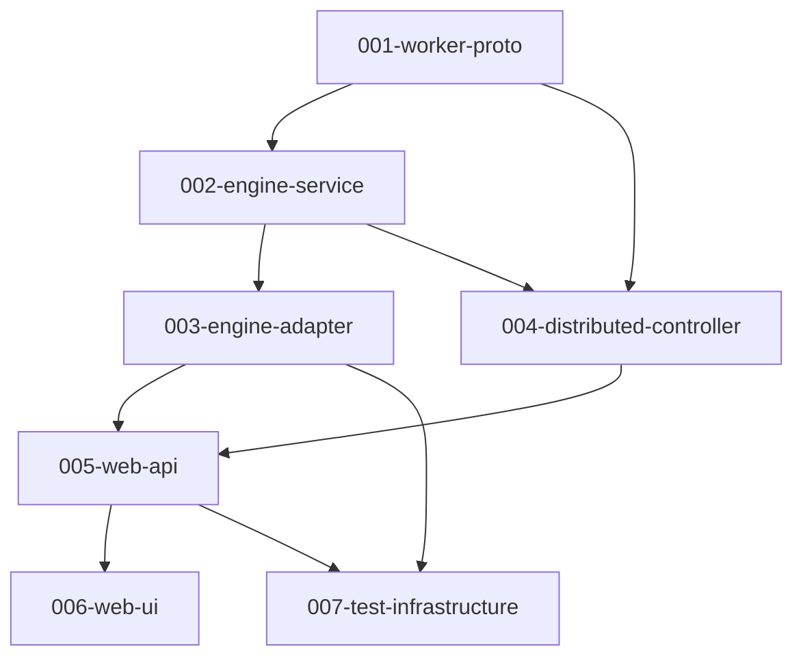

# jMeter Next — Codebase Overview

**Generated**: 2026-03-29
**Mode**: Brownfield Reverse Engineering
**Purpose**: Open-source preparation — proprietary reference audit, code quality assessment, correctness verification

## Project Summary

jMeter Next is a modern rewrite of Apache JMeter — a cloud-era load testing platform that is simple, portable, and powerful. It supports 27+ protocol samplers, arrival-rate executors, load shapes, distributed mode with accurate percentiles using HdrHistogram, and a React-based real-time web UI.

**License**: Apache 2.0
**Primary Language**: Java 21
**Frontend**: TypeScript / React 19
**Build System**: Gradle (Kotlin DSL)

## Codebase Statistics

| Metric | Value |
|--------|-------|
| Source files (source control) | ~576 |
| Source lines | ~105,652 |
| Java modules | 6 |
| Test coverage | Unit + integration tests per module |
| Git commits | 2 (initial + major uplift) |
| Contributors | 1 (Ladislav Bihari) |

## Architecture Overview

```
┌──────────────────────────────────────────────────────────────────────┐
│                           Web Browser                                 │
│                    React 19 + TypeScript + Vite                       │
│               web-ui/ (port 3000 dev, served via Nginx prod)          │
└─────────────────────────────┬────────────────────────────────────────┘
                              │ REST + SSE + WebSocket
┌─────────────────────────────▼────────────────────────────────────────┐
│                          Web API Module                               │
│              Spring Boot 3 (port 8080), JWT auth, H2/SQLite          │
│           modules/web-api/ — REST controllers, JDBC repos             │
└──────┬──────────────────────┬────────────────────────────────────────┘
       │ EngineService         │ DistributedRunService
┌──────▼──────┐        ┌──────▼──────────────────────────────────────┐
│   Engine    │        │         Distributed Controller               │
│  Adapter   │        │   modules/distributed-controller/            │
│  module     │        │   gRPC to workers, result aggregation        │
└──────┬──────┘        └──────┬──────────────────────────────────────┘
       │                       │ gRPC (proto3)
┌──────▼──────────────────────┐  ┌──────────────────────────────────┐
│       Engine Service        │  │        Worker Node(s)            │
│  modules/engine-service/    │  │   modules/worker-node/           │
│  Pure Java, JDK-only        │  │   Spring Boot gRPC server        │
│  (no framework dependency)  │  └──────────────────────────────────┘
└─────────────────────────────┘
```

## Module Structure

| Module | Domain | Dependency Level |
|--------|--------|-----------------|
| `worker-proto` | gRPC wire protocol definitions | 1 — Foundation |
| `engine-service` | Core execution abstractions (JDK-only) | 2 — Core |
| `engine-adapter` | JMeter integration + JMX parsing | 3 — Adapter |
| `distributed-controller` | Multi-worker orchestration | 4 — Distributed |
| `web-api` | REST API + persistence + security | 5 — Application |
| `web-ui` | React TypeScript frontend | 6 — Presentation |

## Domain Summary

| # | Domain | Purpose | Key Files | Dependencies |
|---|--------|---------|-----------|--------------|
| 001 | worker-proto | gRPC wire protocol | worker.proto | None |
| 002 | engine-service | Core execution interfaces, SLA, metrics | EngineService.java, ArrivalRateExecutor.java, SlaEvaluator.java | 001 |
| 003 | engine-adapter | JMeter JMX parsing, sampler executors, HTTP clients | JmxParser.java, TestPlanExecutor.java, 50+ interpreter files | 002 |
| 004 | distributed-controller | Multi-worker coordination via gRPC | DistributedRunService.java, ResultAggregator.java, WorkerClient.java | 001, 002 |
| 005 | web-api | Spring Boot REST API, JWT auth, JDBC persistence | TestRunController.java, JwtTokenService.java, JDBC repos | 002, 003, 004 |
| 006 | web-ui | React frontend: test plan tree, live dashboard, distributed config | TestPlanTree.tsx, LiveDashboard.tsx, PropertyPanel.tsx | 005 (API) |
| 007 | test-infrastructure | Test servers (MQTT, HTTP mock), CI/CD, Docker | docker-compose*.yml, GitHub Actions workflows | All |

## Open-Source Readiness Assessment

### Proprietary Reference Scan Results

| Reference | Status | Location | Action Required |
|-----------|--------|----------|-----------------|
| `stats perform` | ✅ NOT FOUND | — | None |
| `opta` | ✅ NOT FOUND | — | None |
| Sports analytics domain | ✅ NOT FOUND | — | None |
| Internal API endpoints | ✅ NOT FOUND | — | None |
| Private NPM registry | ✅ NOT FOUND | — | None |
| Internal artifacts repo | ✅ NOT FOUND | — | None |
| `github.com/Testimonial/b3meter.git` | ⚠️ PLACEHOLDER | README.md:54 | Replace with actual org |
| Personal email addresses | ✅ NOT FOUND | — | None |
| Hardcoded secrets/keys | ✅ NOT FOUND | — | None |
| Internal hostnames | ✅ NOT FOUND | — | None |

### Overall OSS Readiness: 🟢 READY (with 1 minor fix)

**One action required**: Update `README.md:54` to replace `github.com/Testimonial/b3meter.git` with the actual target GitHub organization URL.

## Dependency Graph (Mermaid)



## Implementation Order (for Contributors)

### Phase 1: Foundation
- `001-re-worker-proto` — gRPC protocol definitions; must be stable before distributed work
- `002-re-engine-service` — Core interfaces; JDK-only, zero framework deps

### Phase 2: Core Engine
- `003-re-engine-adapter` — JMeter integration; largest module (~50 interpreter classes)

### Phase 3: Distributed & API
- `004-re-distributed-controller` — Requires worker-proto + engine-service
- `005-re-web-api` — REST API + persistence; integrates all engine modules

### Phase 4: Frontend & Infrastructure
- `006-re-web-ui` — React frontend; self-contained once API is stable
- `007-re-test-infrastructure` — CI/CD, Docker, test servers; can evolve independently

## Next Steps

1. Fix the one identified proprietary reference (`README.md:54`)
2. Review per-domain specs for code quality findings
3. Run `/speckit.reverse-eng.verify` to check coverage
4. Run `/speckit.reverse-eng.validate` for spec quality gates
